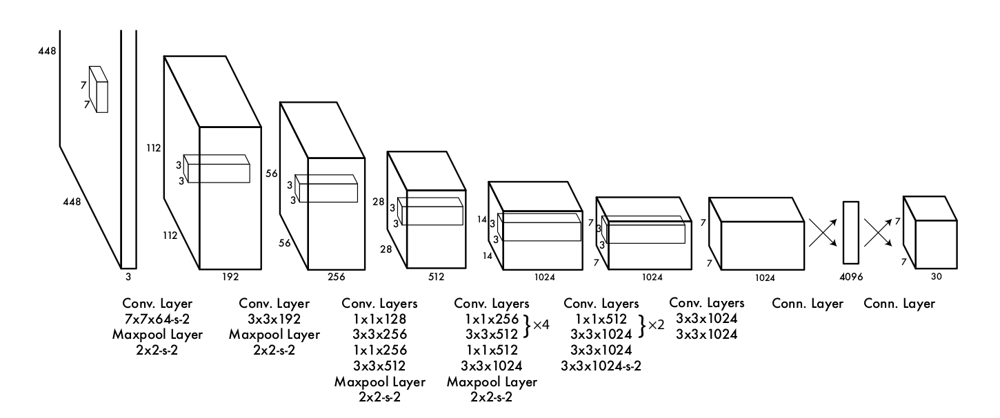

## YOLO-V1论文复现

### 背景

在进行多模态大模型进行目标检测前，先用经典的目标检测框架提高自己对目标检测流程、数据预处理、不同架构的优缺点及目标检测评估中各种概念的了解，夯实目标检测基础，加油吧!

### 目录结构说明

- datasets： 数据集存放位置，label为真实文件，原始图像为symbol link
- raw_paper： yolov1的原始论文
- utils： 存放常用功能脚本
- modules： 模型的组件
- train.py： 训练脚本
- predict.py： 预测脚本
- visual.py： 训练结果可视化脚本
- main.ipynb： 整体流程的构思过程
- data_preprocess.ipynb： 数据预处理构思流程
- demo.ipynb： loss的调试
- debug.ipynb： 过拟合测试

### 模型结构说明

模型整体架构为YOLO-V1论文里的架构的**改编版**，原模型如下



- backbone为VGG架构，Detect_head为两个全连接层.
- 激活函数将论文中的LeakyReLU改为了全Relu，因为图像的归一化操作及后续的loss计算都要求元素的范围是大于0的.
- **论文的关键点：每个grid的预选框仅一个有效，从loss计算到后处理均是.**

### 后续规划

- 完善命令行给参数，实现训练、预测
- 模型效果很差，检查数据集处理、loss设计、推理算法

### 个人理解 + 收获

#### 一、pytorch中mask的灵活运用

参考loss.py中的实现，发现许多操作都是mask提取实现的，如从一些连续的tensor中提取出某个部分，我们可以先生成对应的mask然后reshape即可.

注意下面两种方式

```py
# 注意要符合数据的要求，归一化后数值0~1
pre = torch.randn(1,30,7,7)  # 随机预测张量 [batch, S, S, B*5+C]
tar = torch.randn(1,30,7,7)  # 随机目标张量
mask1 = pre > 0
mask2 = tar > 0
pre[~mask1] = 0
tar[~mask2] = 0
print(pre)
# pre保持原形状
```

```py
# 设置有目标的mask
coord_mask = target[:,:,:,4] > 0
coord_mask = coord_mask.unsqueeze(-1).expand_as(target)
# 提取有目标的target
coord_target = target[coord_mask].reshape(-1, 5 * B + C)
```

#### 二、激活函数Relu的作用

搞了这么久终于理解了为什么要用Relu了，呜呜呜，原来目标检测任务后续的很多操作，如归一化，开根号等操作均要求值大于0,否则NAN！

#### 三、torch.cat与torch.stack的区别

torch.cat主要用于拼接，而torch.stack用于将列表维度转化为tensor维度，一个简单的例子

```py
x1 = torch.rand((7,7,30))
x2 = torch.rand((7,7,30))
x = [x1,x2]
y1 = torch.stack(x,dim = 0)
y2 = torch.cat(x,dim = 0)
print(y1.shape)
print(y2.shape)
# 输出
# torch.Size([2, 7, 7, 30])
# torch.Size([14, 7, 30])
```

#### 四、非极大值抑制(NMS)在目标检测框的应用

非极大值抑制的流程如下：

- 根据置信度得分进行排序
- 选择置信度最高的比边界框添加到最终输出列表中，将其从边界框列表中删除
- 计算所有边界框的面积
- 计算置信度最高的边界框与其它候选框的IoU。
- 删除IoU大于阈值的边界框
- 重复上述过程，直至边界框列表为空。

参考：https://zhuanlan.zhihu.com/p/37489043

#### 五、sigmoid激活函数的应用

原本的全连接层后用**Relu函数**作为输出层的激活函数，loss收敛后效果仍旧很差，**recall率几乎为0**,可能认为不检测的loss还比检测到的小，于是模型错误地往这个方向去收敛了，故我们把模型的最后一层激活函数换成了sigmoid激活函数，让输出层的结果均在[0,1]范围，符合检测框的物理意义，最后对单个图片过拟合还是可以的.

### 参考文献

- yolo论文原文： https://arxiv.org/abs/1506.02640
- 知乎解读yolo论文： https://zhuanlan.zhihu.com/p/70387154
- github开源代码yolov1实现： https://github.com/yaoyi30/Pytorch_YOLOv1